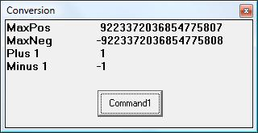

<div align="center">

## Convert two dWords to a qWord


</div>

### Description

How to convert two 32-bit dWords to a 64-bit qWord.
 
### More Info
 


<span>             |<span>
---                |---
**Submitted On**   |
**By**             |[ULLI](https://github.com/Planet-Source-Code/PSCIndex/blob/master/ByAuthor/ulli.md)
**Level**          |Beginner
**User Rating**    |4.7 (14 globes from 3 users)
**Compatibility**  |VB 6\.0
**Category**       |[Math/ Dates](https://github.com/Planet-Source-Code/PSCIndex/blob/master/ByCategory/math-dates__1-37.md)
**World**          |[Visual Basic](https://github.com/Planet-Source-Code/PSCIndex/blob/master/ByWorld/visual-basic.md)
**Archive File**   |[](https://github.com/Planet-Source-Code/ulli-convert-two-dwords-to-a-qword__1-72034/archive/master.zip)

### API Declarations

none, pure basic


### Source Code

```
Option Explicit
Private Type tLoHi 'remember - we are little endian
  Lo As Long
  Hi As Long
End Type
Private Type tCurr
  LoHi As Currency
End Type
Private Function Convert(ByVal HiWord As Long, ByVal LoWord As Long) As Variant
 'convert two 32bit dWords to a 64bit qWord
 Dim LoHi As tLoHi
 Dim Curr As tCurr
  LoHi.Hi = HiWord
  LoHi.Lo = LoWord
  LSet Curr = LoHi
  Convert = CDec(Curr.LoHi) * 10000    'remove decimal point from currency
End Function
Private Sub Command1_Click()
  Cls
  Print "MaxPos ", Convert(&H7FFFFFFF, &HFFFFFFFF)
  Print "MaxNeg ", Convert(&H80000000, 0)
  Print "Plus 1 ", Convert(0, 1)
  Print "Minus 1", Convert(&HFFFFFFFF, &HFFFFFFFF)
End Sub
```

